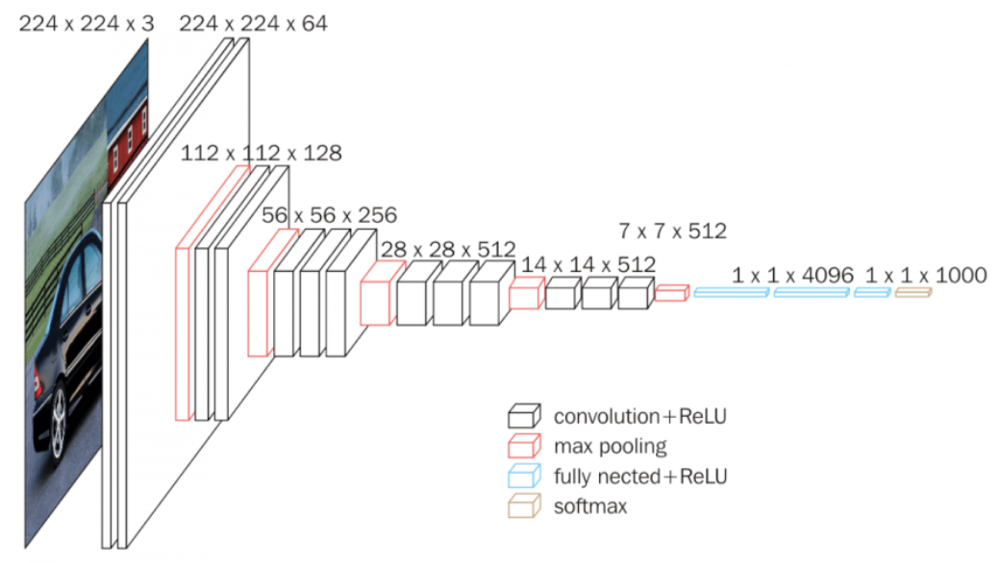

# Popular CNN architectures

## LeNet  
The LeNet architecture is one of the classic architectures of a CNN.
It consists of only seven layers(3 convolutional layers, 2 pooling layers, 1 fully connected layer, and 1 output layer).
It uses a 5 x 5 convolution with a stride of 1, and uses average pooling. 

## AlexNet 
AlexNet is a classic and powerful deep learning architecture. It won the ILSVRC 2012 by significantly reducing the error rate from 26% to 15.3%. 
ILSVRC stands for ImageNet Large Scale Visual Recognition Competition, which is one of the biggest competitions focused on computer vision tasks, such as image 
classification, localization, object detection, and more.

ImageNet is a huge dataset containing over 15 million labeled, high-resolution images, with over 22,000 categories. 
AlexNet was designed by Alex Krizhevsky, Geoffrey Hinton, and Ilya Sutskever.
It consists of 5 convolutional layers and 3 fully connected layers.

It uses the ReLU activation function instead of the tanh function, and ReLU is applied after every layer. It uses dropout to handle overfitting, and dropout 
is performed before the first and second fully connected layers. It uses data augmentation techniques, such as image translation, and is trained using 
batch stochastic gradient descent.

## VGGNet
VGGNet is one of the most popularly used CNN architectures. It was invented by the Visual Geometry Group (VGG) at the University of Oxford. It started to get 
very popular when it became the first runner-up of ILSVRC 2014.

It consists of convolutional layers followed by a pooling layer and then again convolutional layers followed by polling layers. It uses 3 x 3 convolution and 
2 x 2 pooling throughout the network. It is referred to as VGG-n, where n corresponds to a number of layers, excluding the pooling and softmax layer. 
An example value of n is 16. The one shortcoming of VGGNet is that it is computationally expensive, and it has over 160 million parameters.

## GoogleNet
GoogleNet, also known as inception net, was the winner of ILSVRC 2014. It consists of various versions, and each version is an improved version of the previous 
one. We will explore each version one by one.

### Inception V1
Consider a problem where objects can appear on any region of the image. It might be small or big. It might take up a whole region of the image, or just a very small portion. Our network has to exactly identify the object. We use a filter to extract features from the image, but because the object of interest varies in size and location in each image, choosing the right filter size is difficult.

We can use a filter of a large size when the object size is large, but a large filter size is not suitable when we have to detect an object that is in a small corner of an image. Since we use a fixed receptive field that is a fixed filter size, it is difficult to recognize objects in the images whose position varies greatly. We can use deep networks, but they are more vulnerable to overfitting.

To overcome this, instead of using a single filter of the same size, the inception network uses multiple filters of varying sizes on the same input. An inception network consists of nine inception blocks stacked over one another.

For one of the inception blocks/mudules, we perform convolution operations on a given image with three different filters, that is, 1 x 1, 3 x 3, and 5 x 5. Once the convolution operation is performed by all these different filters, we concatenate the results and feed it to the next inception block. Padding is appropriately added to keep the height and width the same across filters since they will simply be concatenated at the end. However, this concatenation results in increasing depth, so we need to adjust the nummber of filters so that the concatenation of filters doesn't increase the depth. 

A 1\*1 filter is added before the 3\*3 and 5\*5 layers so as to lessen the number of operations. The 1\*1 operation does result in increased number of parameters to train(due to the addition of the weights of 1\*1 filters), however the net number of operations in convolution are greatly lessened as discussed [here](https://medium.com/coinmonks/paper-review-of-googlenet-inception-v1-winner-of-ilsvlc-2014-image-classification-c2b3565a64e7). The net result is decrease in complexity. The 1\*1 is used with relu so it also increases non-linearity. 

As the inception network is deep, with nine inception blocks, it is susceptible to the vanishing-gradient problem.  To avoid this, we introduce classifiers between the inception blocks. This is done at the end of the 3rd and the 6th block and the loss from these classifers is called the auxillary loss wich is weighted and added to the final layer loss. 

## Inception v2 and v3

In these networks, factorized convolution is used i.e. we can break down a convolutional layer with a larger filter size into a stack of convolutional layers with a smaller filter size. So, in the inception block, a convolutional layer with a 5 x 5 filter can be broken down into two convolutional layers with 3 x 3 filters.
Having a factorized convolution increases performance and speed(in which cases ?). The authors also suggest breaking down a convolutional layer of filter size n x n into a stack of convolutional layers with filter sizes 1 x n and n x 1. However, that results in expanding our network in a deeper fashion, which will lead to loss of information. So, instead of making it deeper, we make our network wider.

In inception net v3, we use factorized 7 x 7 convolutions with RMSProp optimizers. Also, we apply batch normalization in the auxiliary classifiers.

