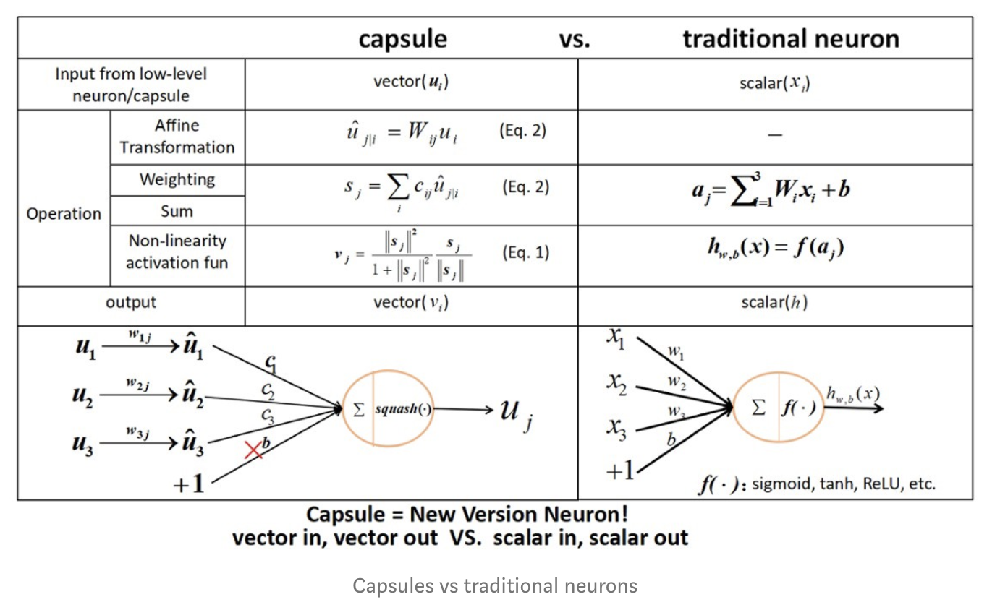

# Capsule Networks
Capsule networks (CapsNets) were introduced by Geoffrey Hinton to overcome the limitations of convolutional networks.
Hinton stated the following: "The pooling operation used in convolutional neural networks is a big mistake and the fact that it works so well is a disaster."

### What is wrong with pooling operation ?
The pooling operation is used to reduce dimensionality and to remove unwanted information? The pooling
operation makes our CNN representation invariant to small translations in the input. This translation invariance property of a CNN is not always beneficial, 
and can be prone to misclassifications. For example, let's say we need to recognize whether an image has a face; the CNN will look for whether the image has eyes,
a nose, a mouth, and ears. It does not care about which location they are in. If it finds all such features, then it classifies it as a face. This problem will 
become worse when we have a deep network, as in the deep network, the features will become abstract, and it will also shrink in size due to the several pooling 
operations. (but doesn't the CNN also look for structure and how the parts are joined together ?)

An important thing to understand is that higher-level features combine lower-level features as a weighted sum: activation of a preceding layer are multiplied by
the following layer neuron’s weights and added, before being passed to activation non-linearity. Nowhere in this information flow are the relationships between 
features taken into account. This is simply a flaw in the core design of CNNs since they are based on the basic convolution operation applied to scalar values.

To overcome this, Hinton introduced the Capsule network, which consists of capsules instead of neurons. Like a CNN, the Capsule network checks for the presence of
certain features to classify the image, but it also checks the spatial relationship between them. The key to this richer feature representation is the use of 
vectors rather than scalers. 

Let’s review the basic operations of a convolution in a CNN: matrix multiply (i.e scalar waiting), add it all up, scalar-to-scalar mapping (i.e the activation 
function). Here are the steps(from [here](https://towardsdatascience.com/a-simple-and-intuitive-explanation-of-hintons-capsule-networks-b59792ad46b1)):
- scalar weighting of input scalars
- Sum of weighted input scalars
- scalar-to-scalar non-linearity

The change for Capsule networks can be broken down simply by using vectors instead of scalars:
- matrix multiplication of input vectors
- scalar weighting of input vectors
- sum of weighted input vectors
- vector-to-vector non-linearity

## What is a capsule ?
A capsule is a group of neurons that learn to detect a particular feature in the image; say, eyes. Unlike neurons, which return a scalar, capsules return a vector.
The length of the vector tells us whether a particular feature exists in a given location, and the elements of the vector represent the properties of the features,
such as, position, angle, and so on.

Just like a CNN, capsules in the earlier layers detect basic features including eyes, a nose, and so on, and the capsules in the higher layers detect high-level 
features, such as the overall face. Thus, capsules in the higher layers take input from the capsules in the lower layers. In order for the capsules in the higher 
layers to detect a face, they not only check for the presence of features such as a nose and eyes, but also check their spatial relationships.

## Capsule Networks
The capusle activations from the lower layers are summed up(after multiplying the inputs with the weights), other computations are performed and then a squash 
operation is performed to arrive at an activation for a higher level capsule. 
