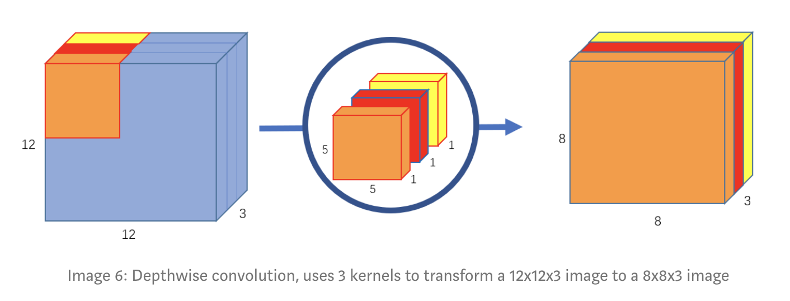

# Seperable Convolutions
There are two main types of separable convolutions: spatial separable convolutions, and depthwise separable convolutions.

## Spatial Seperable Convolutions
The spatial separable convolution is so named because it deals primarily with the spatial dimensions of an image and kernel: the width and the height.
A spatial separable convolution simply divides a kernel into two, smaller kernels. The most common case would be to divide a 3x3 kernel into a 3x1 and 1x3 kernel.
Now, instead of doing one convolution with 9 multiplications, we do two convolutions with 3 multiplications each (6 in total) to achieve the same effect. 
With less multiplications, computational complexity goes down, and the network is able to run faster.

One of the most famous convolutions that can be separated spatially is the Sobel kernel, used to detect edges. 

- The main issue with the spatial separable convolution is that not all kernels can be “separated” into two, smaller kernels.

## Depthwise Separable Convolutions
The depthwise separable convolution is so named because it deals not just with the spatial dimensions, but with the depth dimension—the number of channels— as well.
Similar to the spatial separable convolution, a depthwise separable convolution splits a kernel into 2 separate kernels that do two convolutions: 
- the depthwise convolution
- the pointwise convolution 

### Depthwise Convolution 

Consider we are applying a depth wise convolution on a 12\*12\*3 image. The conv size is 5\*5. Now, for each of the 3 channels we use a different kernel. 
Therefore in total 3 kernels are used and each one, transforms one of the input channels to 1 output channel. The size of the output is 8\*8\*3. 
While performing this operation, no correlation between the channels is taken into account. In this case, the output channels have to be identical to input channels
and that is also equal to the number of kernels used. 

Note: It’s worth noting that in both Keras and Tensorflow, there is a argument called the “depth multiplier”. It is set to 1 at default. By changing this 
argument, we can change the number of output channels in the depthwise convolution. For example, if we set the depth multiplier to 2, each 5x5x1 kernel will 
give out an output image of 8x8x2, making the total (stacked) output of the depthwise convolution 8x8x6 instead of 8x8x3.

### Pointwise Convolution
Say, now we want to increase the number of channels and consider interactions amongst the channels. 
The pointwise convolution is so named because it uses a 1x1 kernel, or a kernel that iterates through every single point. This kernel has a depth of however many 
channels the input image has; in our case, 3. Therefore, we iterate a 1x1x3 kernel through our 8x8x3 image, to get a 8x8x1 image.
To increase the depth to k, we use k kernels. 

### Why use Depthwise Separable Convolutions ?
It has much less number of computations required and speeds up the process. For a sample calculation, look at the reference. 

[Reference : Intro to seperable convolutions](https://towardsdatascience.com/a-basic-introduction-to-separable-convolutions-b99ec3102728)
